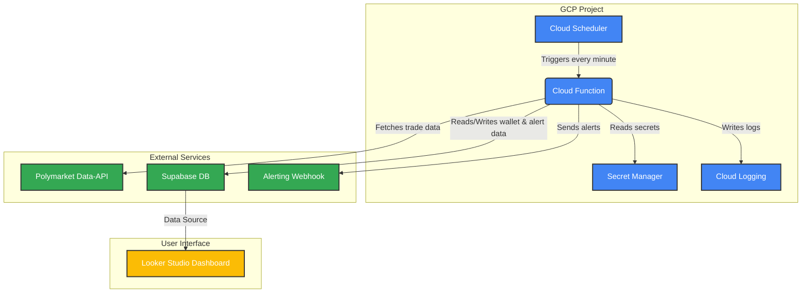

# Polymarket Whale Alert System

**polywhaler** is a sophisticated, serverless system designed to identify and alert on potentially market-moving trades made by "sophisticated whales" on the Polymarket prediction market platform. The system ingests real-time trade and on-chain data, applies a weighted, heuristic-based "Confidence Score" to identify high-conviction trading activity, and provides timely alerts to inform personal trading strategies.

This project moves beyond simple "insider trading" detection to a more nuanced model of identifying "sharp money"—market participants who demonstrate a superior analytical edge or access to unique informational resources.

## Key Features

- **Sophisticated Whale Detection**: Implements a dynamic "Confidence Score" model that weights multiple heuristics (e.g., trade size, wallet age, liquidity-taking activity, preparatory on-chain actions) to generate a nuanced measure of signal strength.
- **Resilient Data Ingestion**: Features a two-mode (backfill/steady-state) polling engine designed to be resilient to API rate limits and temporary outages, with exponential backoff and jitter.
- **Production-Ready Architecture**: Built on a secure, scalable, and cost-effective serverless stack, leveraging Google Cloud Platform for compute and Supabase (PostgreSQL) for its relational data backend.
- **Secure and Automated Operations**: Employs a hardened CI/CD pipeline using GitHub Actions with OpenID Connect (OIDC) for secure, keyless deployments and GCP Secret Manager for all credentials.
- **Data-Driven Validation**: Includes a comprehensive historical backtesting framework to quantitatively validate and tune the detection algorithm's profitability before live deployment.

## Architectural Overview

The system is designed around a serverless-first philosophy, leveraging fully managed cloud services to minimize operational overhead and ensure scalability. The architecture is engineered for reliability, security, and near-zero cost at the MVP scale.

### Core Components:

1.  **Orchestration (Cloud Scheduler)**: A cron job triggers the entire process at a regular interval.
2.  **Compute (Cloud Function)**: A Python-based serverless function contains all the application logic: fetching data from the Polymarket API, applying the Confidence Score algorithm, interacting with the database, and dispatching alerts.
3.  **Data Backend (Supabase/PostgreSQL)**: A robust, relational database stores all system data, including tracked markets, whale wallet profiles, historical trades, and sent alerts. This choice is critical for supporting the complex analytical queries required for P&L tracking and performance analysis.
4.  **Logging (Cloud Logging)**: All operational logs are sent to GCP's native logging service, providing a secure, scalable, and queryable audit trail.
5.  **Dashboarding (Looker Studio)**: A user-facing dashboard for visualizing alert data is built using Looker Studio, which connects directly to the Supabase database.
6.  **Security (Secret Manager & OIDC)**: The Supabase connection string is securely stored in GCP Secret Manager. Deployments are managed via a keyless CI/CD pipeline using GitHub Actions and OIDC.

## Development & Deployment Roadmap

This project follows a disciplined, phased approach to development, validation, and deployment.

### Phase 1: Foundational Setup & Architecture (1-2 Days)

- **Provision Supabase Project**: Create a new project on the Supabase Pro plan and define the relational schema (tables for `Whale_Wallets`, `Trades`, `Tracked_Markets`).
- **Provision GCP Project**: Enable all necessary services (Cloud Functions, Scheduler, Secret Manager, Logging).
- **Configure Secure Deployment**: Establish the OIDC trust relationship between GCP and a private GitHub repository.

### Phase 2: Core Logic & Algorithm Finalization (3-5 Days)

- **Develop Data Ingestion Module**: Implement the two-mode (backfill/steady-state) polling logic with robust error handling.
- **Implement Confidence Score Algorithm**: Code the core detection logic with configurable weights for each heuristic.
- **Develop Data Persistence Logic**: Write the data access layer to interact with the Supabase database.

### Phase 3: Backtesting & Pre-Launch Validation (5-10 Days)

- **Implement Historical Backtesting Framework**: Build a script to pull the complete trade history of several resolved Polymarket markets.
- **Run and Tune Algorithm**: Execute the algorithm against the historical dataset to analyze the profitability of the signals that would have been generated.
- **Iterate and Refine**: Use the quantitative results to tune the heuristic weights and establish a baseline performance metric.

### Phase 4: Final Go/No-Go Decision & MVP Deployment

- **Review Backtesting Results**: Make a formal go/no-go decision based on the empirical evidence from the backtest. This step serves as a **critical process checkpoint** to prevent contextual drift by formally comparing the quantitative results of the implemented strategy against the project's original hypothesis.
- **Deploy MVP**: If the decision is "go," use the pre-configured secure CI/CD pipeline to deploy the Cloud Function and activate the Cloud Scheduler job.

## Post-MVP Evolution: Machine Learning Integration

A strategic, two-phase approach to ML implementation is planned to evolve the system's signal intelligence.

1.  **Phase 1 (Validation)**: Utilize **Google Vertex AI AutoML** to achieve the fastest possible path to a baseline classification model with the lowest Total Cost of Ownership (TCO) when factoring in developer time.
2.  **Phase 2 (Optimization & Scale)**: After the model's value is proven, re-implement the training pipeline as a custom, fine-tuned solution on a more cost-effective IaaS platform like **Lambda Labs** to dramatically reduce long-term compute costs and gain granular control.

## Risk & Mitigation Summary

This table summarizes the key identified risks and the final mitigation strategies that have been integrated into the system's design.

| Risk ID | Domain        | Risk Description                                                                                             | Mitigation Strategy                                                                                                                             |
| :------ | :------------ | :----------------------------------------------------------------------------------------------------------- | :---------------------------------------------------------------------------------------------------------------------------------------------- |
| **T-01**  | Technical     | **API Rate Limit Exceeded**: Polling logic overwhelms the Polymarket API, causing failures and missed data.         | Implement two-mode (backfill/steady-state) polling and exponential backoff with jitter for all API calls.                                         |
| **T-02**  | Technical     | **Insecure Credential Handling**: Storing service account keys or connection strings insecurely.              | Use Workload Identity Federation (OIDC) for GCP auth and GCP Secret Manager for the Supabase connection string.                                   |
| **T-03**  | Technical     | **Unsupported Real-Time API**: Building on an unsupported WebSocket feature, risking silent data loss.          | Postpone all WebSocket development. Continue with the robust, optimized polling strategy as the sole data ingestion method.                      |
| **P-01**  | Platform      | **Sudden Change to API or ToS**: Polymarket updates an endpoint or usage policy, breaking the system.         | Implement comprehensive monitoring on API response schemas to detect breaking changes immediately. Subscribe to official developer channels. |
| **J-01**  | Jurisdictional| **User's State Restricts Platform Access**: Operator resides in a U.S. state where Polymarket is blocked.      | Include a configurable "jurisdiction profile" to filter alerts from markets inaccessible to the operator.                                    |
| **S-01**  | Strategic     | **Alpha Decay from Competition**: The "edge" from simple heuristics is arbitraged away by other tools.        | Prioritize development of novel, non-obvious heuristics (e.g., wallet funding analysis, cluster detection). Design for rapid experimentation. |
